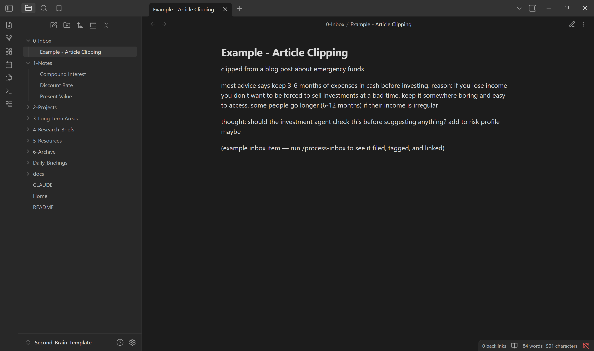
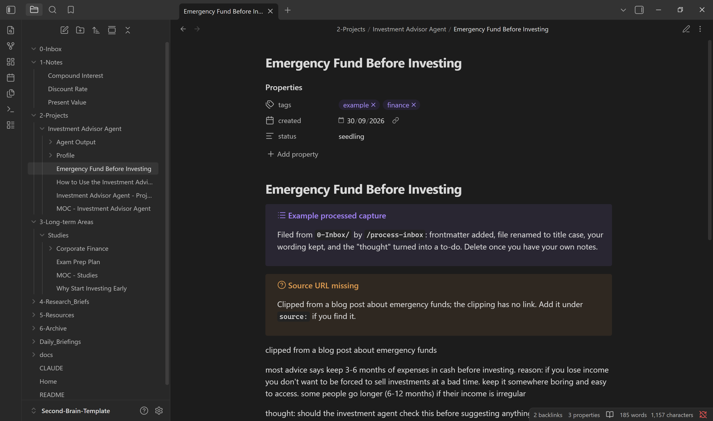
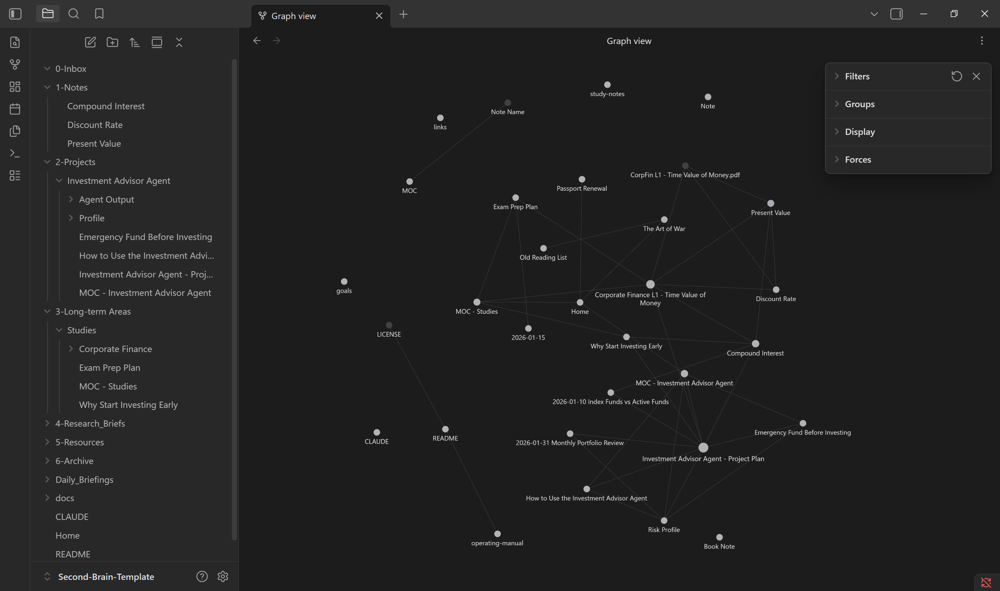

# Obsidian + Claude Code Second Brain (Template)

**You capture, Claude Code organises.** Drop notes, clippings, transcripts, PDFs, and slides into an inbox; one command turns them into tagged, linked, well-structured notes filed in the right place.

A ready-to-use Obsidian vault with a rulebook (`CLAUDE.md`), five Claude Code skills, study-note templates, and worked examples in every folder. No personal content.

| Before: raw inbox capture | After: `/process-inbox` |
|---|---|
|  |  |



## What it does

| Command | What happens |
|---|---|
| `/setup` | First run: a few questions, then it personalises `CLAUDE.md` and `goals.md` and clears the examples |
| `/process-inbox` | Files everything in `0-Inbox/`: study notes for PDFs and slides, tags, links, Maps of Content, originals kept untouched — then a summary and a git commit |
| `/study-note <file>` | Turns one lecture, reading, or case study into a study note built on the Cornell method, active recall, and the Feynman technique |
| `/weekly-review` | Keeps the vault healthy: tag clean-up, orphan notes, stale drafts, missing links |
| `/find-related <topic>` | Finds related notes by topic, including related terms, with a reason for each |

## Requirements

- **[Obsidian](https://obsidian.md)** (free) with the **Dataview**, **Templater**, and **Tasks** community plugins
- **[Claude Code](https://claude.com/claude-code)** (terminal or desktop app). It needs a paid Claude plan or Anthropic API credits, and every command uses tokens from that allowance.
- **Git** (recommended) — every run is committed, so any change can be undone
- Works on Windows, macOS, and Linux

## Quick start

1. **Get the template:** click "Use this template" on GitHub (or clone it), and put the folder where you want your vault.
2. **Open it in Obsidian** as a vault. In Settings → Community plugins, install and enable **Dataview**, **Templater**, and **Tasks**. In Templater's settings, set the template folder to `5-Resources/Templates` (press Alt+E in a note to insert one).
3. **Open Claude Code in the vault folder** (terminal: `cd` into the folder and run `claude`, or use the desktop app).
4. **Run `/setup`:** a few questions about you, your goals, and your topics, then it fills in `CLAUDE.md` and `goals.md` for you and offers to clear the examples. (Or edit the `<placeholders>` by hand.)
5. **Set up git:** `git init`, then `git add -A` and `git commit -m "Initial vault"`. If you push your own vault to GitHub, keep that repository **private**.
6. **Try it:** run `/process-inbox` on the example clipping already in `0-Inbox/`, then drop in something of your own.

Optional: to let Claude talk to the running Obsidian app, install the Local REST API community plugin, copy `.mcp.json.example` to `.mcp.json`, and paste in your key (`.mcp.json` is git-ignored). Not needed for normal use — Claude edits notes as plain files.

## How it works

```
0-Inbox/  ──/process-inbox──►  notes filed by topic, tagged, linked into a Map of Content
   │                            PDFs and slides → study note in Notes/, original in Originals/
   └─ unclear items stay put under "Needs you" instead of being guessed
```

| Folder | Holds |
|---|---|
| `0-Inbox/` | Anything new and unprocessed |
| `1-Notes/` | Atomic notes, one reusable idea each |
| `2-Projects/` | Work with an end goal |
| `3-Long-term Areas/` | Ongoing areas: studies, career, health |
| `4-Research_Briefs/` · `Daily_Briefings/` | Output from optional AI agents |
| `5-Resources/` | Books, articles, case studies, life admin, Claude's rule files |
| `6-Archive/` | Finished material — nothing is ever deleted |

**Full guide:** the [Operating Manual](5-Resources/Operating%20Manual.md) (also a note inside the vault) covers capturing, what happens to different file types, tags and MOCs, maintenance, scheduling, rules, costs, and troubleshooting.

## Examples included

Every folder has an example, all tagged `example`, so you can see the finished system before adding your own notes.

| Where | Example | What it shows |
|---|---|---|
| `0-Inbox/` | Example - Article Clipping | A raw capture — run `/process-inbox` on it as your first test |
| `1-Notes/` | Present Value, Discount Rate, Compound Interest | One reusable idea per note, linked from wherever it's used |
| `2-Projects/Investment Advisor Agent/` | Project plan, how-to note, `Profile/`, `Agent Output/` | A project's notes in the vault while its code lives elsewhere |
| `3-Long-term Areas/Studies/` | MOC, study note, processed capture, exam plan | A full study note, `Notes/` and `Originals/`, a MOC, and Tasks checkboxes |
| `4-Research_Briefs/` | Index Funds vs Active Funds | Output from a research agent |
| `5-Resources/Books/` | The Art of War | A book note from highlights and a reflection |
| `5-Resources/Life-Admin/` | Passport Renewal | Organisational details, never ID numbers |
| `6-Archive/` | Old Reading List | Archiving instead of deleting |
| `Daily_Briefings/` | 2026-01-15 | Output from a daily briefing agent |

**Removing them:** once you're set up, ask Claude "archive or delete all notes tagged `example`", then replace the example tags in `CLAUDE.md` with your own. The examples are illustrations only — the Investment Advisor Agent is a sample project, and nothing in it is investment advice.

## Built on

- **PARA** (Projects, Areas, Resources, Archive) by Tiago Forte — the folder structure, with an inbox added
- **Zettelkasten** — atomic, linked notes in `1-Notes/`
- **Cornell method**, **active recall**, and the **Feynman technique** — the study-note template
- **Maps of Content** — index notes linking each project or area

## License

MIT — see [LICENSE](LICENSE). Use it, adapt it, and share your own version.
